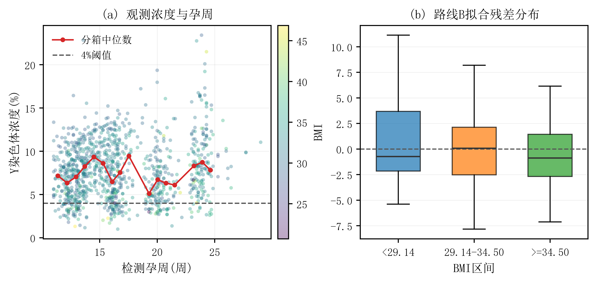
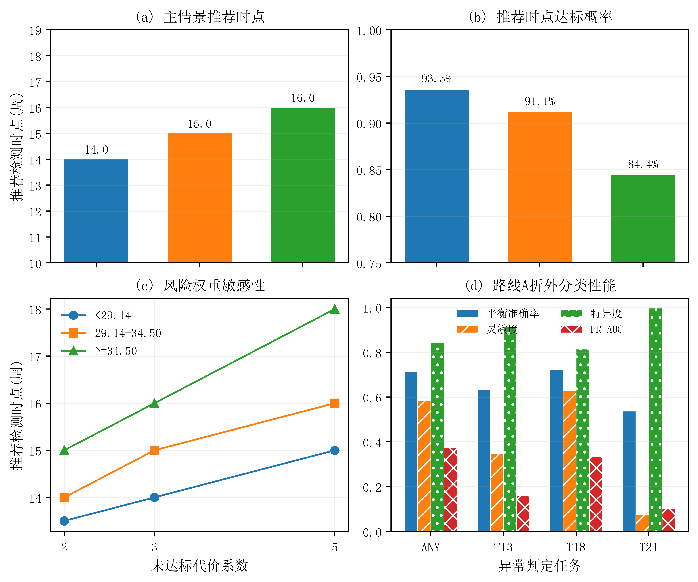

# NIPT 检测时点选择与胎儿染色体异常判定

## 摘要

本文针对 NIPT 中男胎 Y 染色体浓度达标时点选择与女胎染色体异常判定问题，建立纵向浓度模型、区间删失离散风险模型、带约束的 BMI 有序分组模型和校准 Logistic 分类模型。数据包含男胎 1082 条检测记录、267 名孕妇，以及女胎 605 条检测记录、147 名孕妇。同一孕妇可能接受多次检测，因此所有验证均以孕妇代码为分组单位，防止同一人的记录同时进入训练集和验证集。

对于男胎，先以随机截距吸收孕妇内相关性，并以孕周、BMI 的样条项和交互项描述 Y 染色体浓度。该模型的五折验证 RMSE 为 0.03307，但折外 R² 仅为 0.0254，说明可观测变量对单次浓度波动的解释力有限。[claim:Q1-C01] 进一步把首次达到 4% 看作区间删失事件，建立离散时间风险模型。在每组至少 35 人的约束下，对连续 BMI 分区和检测时点联合搜索，得到切点 29.14 和 34.50，三组建议分别在第 14、15、16 周检测。[claim:Q2-C01] 风险权重及测量阈值敏感性分析表明，BMI 切点稳定，而推荐时点会随漏检代价上升而推迟。

对于女胎，以 AB 是否为空作为主二分类标签，以 T13、T18、T21 为次级多标签，采用嵌套的按孕妇分组交叉验证，在内层选择正则强度、校准概率并确定阈值。最终选择较简单的路线 A，其主任务平衡准确率为 0.712、灵敏度为 0.582、特异度为 0.842、PR-AUC 为 0.376。[claim:Q4-C01] 该结果适合作为风险筛查模型，不可替代临床诊断；尤其 T21 阳性样本过少，结论不稳定。[claim:Q4-C02]

**关键词：** NIPT；纵向数据；区间删失；离散时间风险；有序分组；概率校准

## 1 问题重述

NIPT 通过母体外周血中的胎儿游离 DNA 信息判断染色体异常。既有研究表明，孕周、孕妇体重或 BMI 会影响胎儿游离 DNA 比例及无结果风险[1]。男胎样本中 Y 染色体浓度达到 4% 后，检测结果通常更可靠；但较晚检测又会增加异常发现过迟的风险。因此需要同时估计 Y 浓度与孕周、BMI 等因素的关系，按 BMI 划分合理人群，并选择兼顾检测失败和延迟发现的检测时点。女胎不含 Y 染色体，需要利用常染色体与 X 染色体 Z 值、测序质量和孕妇信息判定异常。

本文解决四个问题：

1. 建立男胎 Y 染色体浓度与孕周、BMI 的关系模型并评价其统计表现；
2. 仅依据 BMI 对男胎孕妇分组，给出各组最佳检测时点；
3. 加入年龄、身高、体重、妊娠方式与测序质量，并考虑测量误差和达标概率；
4. 对女胎建立 AB 总体异常判定，并给出 T13、T18、T21 次级结果。

## 2 数据处理与基本假设

### 2.1 数据处理

将“检测孕周”的 `w+d` 字符串转换为连续周数

\[
t=w+\frac{d}{7}.
\]

以孕妇代码识别个体，以检测日期和抽血次数区分纵向记录。数值缺失值在训练折内以该变量均值填补，随后使用训练折均值和标准差进行标准化。女胎 Y 染色体相关空列不进入模型；出生后才可知的“胎儿是否健康”字段不进入预测，避免未来信息泄漏。

女胎 AB 列为空记为总体正常，非空记为总体异常 `ANY=1`；字符串中出现 T13、T18、T21 时，分别生成对应标签。所有交叉验证、超参数选择和阈值选择均按孕妇代码分组。

### 2.2 基本假设

1. 在给定已观测孕妇与测序变量后，随访终止近似为非信息删失。
2. Y 浓度的总体变化随孕周和 BMI 平滑变化，但允许孕妇间存在随机水平差异。
3. 第一次未达标与第一次达标检测之间发生首次达标，可用区间删失表示。
4. BMI 分组必须连续、有序且具有足够样本量，避免只为降低样本内损失而产生极小组。
5. 附件样本代表本题数据人群；由于样本明显偏向较高 BMI，结论不直接外推至未覆盖人群。

## 3 问题一：Y 染色体浓度关系模型

### 3.1 基线模型

设第 \(i\) 名孕妇第 \(j\) 次检测的 Y 浓度为 \(Y_{ij}\)，孕周为 \(t_{ij}\)，BMI 为 \(b_{ij}\)。基线模型为

\[
Y_{ij}=\beta_0+\beta_1t_{ij}+\beta_2b_{ij}
+\beta_3t_{ij}b_{ij}+u_i+\varepsilon_{ij},
\]

其中 \(u_i\) 为孕妇随机截距，\(\varepsilon_{ij}\) 为记录层误差。计算中采用带惩罚的交替最小二乘估计随机截距，防止多次检测较多的孕妇对模型产生过大影响。

### 3.2 非线性主模型

为刻画孕周增长曲线及 BMI 的非线性影响，路线 B 使用广义加性模型的平滑函数思想[2]，以截断三次幂样条构造非线性基：

\[
Y_{ij}=\beta_0+f(t_{ij})+g(b_{ij})
+\gamma t_{ij}b_{ij}+u_i+\varepsilon_{ij}.
\]

样条结点由训练数据分位数确定，固定效应与随机截距均加入 L2 惩罚。五折验证严格按孕妇划分。路线 B 的 RMSE、MAE 和 R² 分别为 0.03307、0.02695 和 0.0254；路线 A 的 RMSE 为 0.03336。B 的误差略小，但其 RMSE 95% Bootstrap 区间为 \([0.03064,0.03543]\)，与 A 的区间重叠。[claim:Q1-C02]

为直接检验关系显著性，进一步在路线 A 中按孕妇进行 120 次有放回 Bootstrap。BMI 的标准化系数为 -0.00978，95% 区间为 \([-0.01753,-0.00191]\)，双侧符号检验 \(p=0.0167\)，表明在该模型和样本范围内 BMI 与 Y 浓度呈显著负向关系。孕周主效应和孕周与 BMI 交互项的区间均跨 0，分别得到 \(p=0.8667\) 和 \(p=0.3000\)，未发现显著的独立线性效应。[claim:Q1-C03]

因此，BMI 的负向关联具有统计证据，但孕周效应更适合由非线性概率模型描述。即便如此，路线 B 的总体折外解释力仍较低，不能解释大部分单次测量波动。后续时点决策不直接把浓度点预测当作确定值，而使用达标概率并保留不确定性。

**图1** 不同BMI水平下Y染色体浓度与孕周的观测及路线B固定效应拟合

## 4 问题二与问题三：BMI 分组和检测时点

### 4.1 首次达标的区间删失模型

定义

\[
T_i=\inf\{t:Y_i(t)\ge 0.04\}.
\]

若孕妇先在 \(L_i\) 周未达标、后在 \(R_i\) 周达标，则仅知道 \(T_i\in(L_i,R_i]\)；首次检测即达标视为左删失，随访结束仍未达标视为右删失。该表述与区间删失分布估计的经典框架一致[3]。数据中三类数量分别为 43、217 和 7。

在半周网格上定义离散风险

\[
h_i(t)=P(T_i=t\mid T_i\ge t,\mathbf x_i(t))
=\operatorname{logit}^{-1}(\mathbf x_i(t)^\top\theta),
\]

以及生存概率和累计达标概率

\[
S_i(t)=\prod_{s\le t}[1-h_i(s)],\qquad
F_i(t)=1-S_i(t).
\]

区间删失、左删失和右删失的似然贡献依次为

\[
S_i(L_i)-S_i(R_i),\qquad 1-S_i(R_i),\qquad S_i(L_i).
\]

协变量包括孕周样条、BMI、年龄、身高、体重、IVF 指示、GC 含量、比对比例和过滤比例等。优化 3000 步后，最后两个记录点的惩罚对数似然差为 \(2.38\times10^{-7}\)，表明数值过程已稳定。

### 4.2 风险函数与分组约束

对 BMI 组 \(g\) 在孕周 \(t\) 的检测风险定义为

\[
R_g(t)=c_f\frac{1}{n_g}\sum_{i\in g}[1-F_i(t)]
+c_dD(t),
\]

其中 \(c_f\) 表示过早检测导致未达标的代价，\(c_d\) 表示延迟代价，且

\[
D(t)=\frac{\max(t-12,0)}{15}.
\]

主情景取 \(c_f=3,c_d=1\)。从 BMI 分位点生成候选切点，枚举 3 至 5 个连续有序组，并要求每组至少 35 名孕妇。对每个可行分区，在 10 至 25 周的半周网格上求组内最小风险。共有 46 个分区满足约束，因此所得解是预先规定候选集合内的最优解，而非连续空间的全局最优证明。

### 4.3 分组结果

| BMI 区间 | 样本量 | 推荐孕周 | 预测达标概率 |
|---|---:|---:|---:|
| \(<29.14\) | 40 | 14.0 | 0.935 |
| \([29.14,34.50)\) | 187 | 15.0 | 0.911 |
| \(\ge34.50\) | 40 | 16.0 | 0.844 |

主方案风险为 0.5156，低于统一第 12 周检测的 0.7229。固定临床 BMI 分组的样本内风险虽为 0.4841，但其首尾组只有 5 人和 4 人，违反主模型的最小样本约束，估计不稳定，因此不采用。

### 4.4 多因素与误差敏感性

当失败代价 \(c_f\) 分别取 2、3、5 时，两个 BMI 切点保持不变，三组推荐时点依次为 \([13.5,14,15]\)、\([14,15,16]\) 和 \([15,16,18]\) 周。[claim:Q3-C01] 这说明切点对风险偏好较稳定，但检测时点对漏检代价敏感：越重视一次检测成功率，建议越晚检测。

将达标阈值从 4% 改为 3.8% 与 4.2% 时，切点仍保持不变；推荐时点分别为 \([13.5,14.5,15.5]\) 与 \([15,15.5,16.5]\) 周。若孕周存在系统误差，建议时点相应平移约 0.5 周。因此实际应用时应结合医院的测量误差和风险偏好，而不把单一周数视为绝对界限。

## 5 问题四：女胎异常判定

### 5.1 模型与验证设计

以 `ANY` 为主任务，并分别预测 T13、T18、T21。输入包括四个 Z 值、X 染色体浓度、总体及各染色体 GC 含量、原始与唯一比对读段数、比对和重复比例、过滤比例、BMI、年龄、身高、体重、孕周、孕产史和 IVF 指示。

对每个标签建立带类别权重的 L2 Logistic 模型：

\[
P(Y_k=1\mid\mathbf x)=
\operatorname{logit}^{-1}(\alpha_{k0}+\mathbf x^\top\boldsymbol\alpha_k).
\]

使用五折外层分组验证。每个外层训练集中再进行三折分组验证，从 \(\{0.1,1,10\}\) 选择 L2 强度；用内层折外预测拟合一维概率校准，并仅在内层数据上选择使平衡准确率最大的阈值。外层验证数据不参与调参、校准或阈值选择。

### 5.2 结果

| 任务 | 平衡准确率 | 灵敏度 | 特异度 | PR-AUC | Brier |
|---|---:|---:|---:|---:|---:|
| ANY | 0.712 | 0.582 | 0.842 | 0.376 | 0.085 |
| T13 | 0.632 | 0.348 | 0.916 | 0.162 | 0.035 |
| T18 | 0.722 | 0.630 | 0.814 | 0.333 | 0.061 |
| T21 | 0.537 | 0.077 | 0.997 | 0.101 | 0.021 |

ANY 阳性率为 0.111，其 PR-AUC 高于按流行率随机排序的基准。模型更擅长排除总体正常样本，灵敏度仍只有 0.582，因此适合作为辅助筛查或复核排序工具，不适合单独排除异常。T18 的次级结果相对较好；T21 只有 13 条阳性记录，虽然特异度高，但灵敏度仅为 0.077，不能作稳定结论。[claim:Q4-C02]

路线 B 加入绝对 Z 值、平方项和交互项后，ANY 平衡准确率反而降至 0.663，PR-AUC 降至 0.326。复杂模型没有在折外数据上获益，因此最终选择路线 A，体现“小样本下优先采用可校准、可解释模型”的原则。

由于类别不平衡，本文采用 PR-AUC 而非仅报告普通准确率；PR 曲线在偏斜二分类数据上更能反映阳性类别的识别质量[4]。概率经附加 Sigmoid 映射校准[5]，并使用 Brier 分数评价概率误差[6]。

**图2** BMI分组、风险敏感性与女胎异常判定结果汇总

## 6 模型评价

### 6.1 优点

1. 所有数据拆分均以孕妇为单位，避免纵向记录泄漏。
2. 达标时间采用区间删失似然，没有删除从未达标或首次即达标的孕妇。
3. BMI 分组同时满足顺序、连续和最小样本量约束，推荐时点与风险函数直接对应。
4. 参数、随机种子、运行日志、验证证据和最终指标均已固化，可复现并可审计。
5. Q4 使用嵌套验证与概率校准，避免在外层验证集上选择阈值。

### 6.2 局限

1. 男胎浓度模型折外 R² 较低，未观测生理差异和实验误差仍占主要部分。
2. BMI 分布偏高，低 BMI 与极高 BMI 样本不足，切点不应直接推广到其他人群。
3. 风险函数中的失败代价与延迟代价缺乏统一临床标定，本文用敏感性分析代替唯一价值判断。
4. 半周离散网格限制了时点精度；更密网格需要更多观测支持。
5. 女胎异常标签不平衡，尤其 T21 样本过少；模型只能辅助筛查，必须结合临床标准与进一步检查。

## 7 结论

本文把男胎 Y 浓度的纵向关系、首次达标的删失结构和 BMI 分组决策统一在概率风险框架中。对附件人群，建议按 BMI 29.14 和 34.50 分为三组，并分别在第 14、15、16 周检测。该方案满足每组最少 35 人的稳定性约束，并在预设风险函数下优于统一第 12 周检测。风险偏好或测量阈值变化主要影响推荐时点，对 BMI 切点影响较小。

女胎异常判定采用校准的正则化 Logistic 模型。总体异常识别获得中等区分能力，但仍存在漏检，不能替代诊断；多标签结果中 T21 的证据尤其不足。实际应用应保留人工复核和后续临床检查，并在获得更大规模、更多正常 BMI 和更多异常病例的数据后重新训练与外部验证。

## 参考文献

[1] Kinnings S L, Geis J A, Almasri E, et al. Factors affecting levels of circulating cell-free fetal DNA in maternal plasma and their implications for noninvasive prenatal testing[J]. Prenatal Diagnosis, 2015, 35(8): 816-822. DOI: 10.1002/pd.4625.

[2] Hastie T, Tibshirani R. Generalized additive models[J]. Statistical Science, 1986, 1(3): 297-310. DOI: 10.1214/ss/1177013604.

[3] Turnbull B W. The empirical distribution function with arbitrarily grouped, censored and truncated data[J]. Journal of the Royal Statistical Society: Series B, 1976, 38(3): 290-295. DOI: 10.1111/j.2517-6161.1976.tb01597.x.

[4] Davis J, Goadrich M. The relationship between precision-recall and ROC curves[C]//Proceedings of the 23rd International Conference on Machine Learning. 2006: 233-240. DOI: 10.1145/1143844.1143874.

[5] Platt J C. Probabilistic outputs for support vector machines and comparisons to regularized likelihood methods[M]//Advances in Large Margin Classifiers. Cambridge: MIT Press, 1999: 61-74.

[6] Brier G W. Verification of forecasts expressed in terms of probability[J]. Monthly Weather Review, 1950, 78(1): 1-3. DOI: 10.1175/1520-0493(1950)078<0001:VOFEIT>2.0.CO;2.

## 附录：支撑材料文件列表

1. `tools/c_problem_experiment.py`：数据处理、路线A/B建模、分组优化、嵌套验证与敏感性分析。
2. `workspace/experiments/experiment_plan.json`：正式批量实验配置。
3. `workspace/experiments/FROZEN_RESULTS.json`：人工接受结果及SHA256清单。
4. `workspace/claims/claim_ledger.json`：结论与冻结实验的对应关系。
5. `workspace/figures/`：两幅论文插图及其可复现输出。
